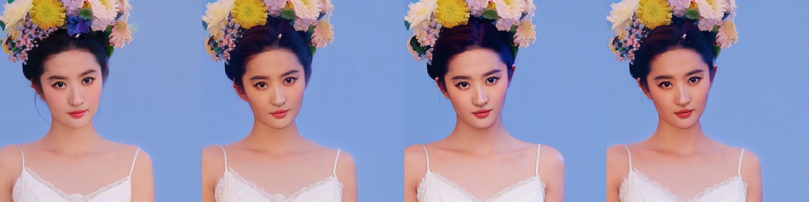

# open FlashFace
Unofficial PyTorch Implementation for [FlashFace](https://arxiv.org/abs/2403.17008). This work is a ReferenceNet absed few shot Identity Personalization.

This project is the minimal implementation of the flashface and still work in process. Please stay tuned for pretrained model releasing.

The generate result based on our pretrained model with prompt: *a woman with a flower in her hair, white dress, looking at viewer, flower, hair ornament, realistic, blue background, hair flower, simple background, upper body*

From left to right means use 1 to 4 faces.



## Update
- [2024-04-06]: Init repo and upload training code.

## Environment
```
torch>2.0
transformers==4.34.1
diffusers==0.22.1
accelerate==0.23.0
```

## Data
prepare data structure

## Train
```bash
PRETRAINED_MODEL=""
accelerate launch --multi_gpu --main_process_port=21634 --mixed_precision=fp16 train.py \
    --pretrained_model_name_or_path=$PRETRAINED_MODEL \
    --output_dir output \
    --metafiles data.jsonl \
    --clip_skip 2 \
    --proportion_empty_prompts 0.1 \
    --proportion_empty_face 0.0 \
    --save_steps 20000 \
    --resolution=512 \
    --learning_rate=5e-6 \
    --train_batch_size=8 \
    --dataloader_num_workers=6 \
    --num_train_epochs=20 \
    --mixed_precision=fp16 \
    --seed 42
```

## Inference
We train a model with about 400M samples on 8 x A100-80G with total batch size 64. Please download it from [here(not ready currently)]() !
```bash
python inference.py
```

## Citation
```
@misc{zhang2024flashface,
      title={FlashFace: Human Image Personalization with High-fidelity Identity Preservation}, 
      author={Shilong Zhang and Lianghua Huang and Xi Chen and Yifei Zhang and Zhi-Fan Wu and Yutong Feng and Wei Wang and Yujun Shen and Yu Liu and Ping Luo},
      year={2024},
      eprint={2403.17008},
      archivePrefix={arXiv},
      primaryClass={cs.CV}
}
```
